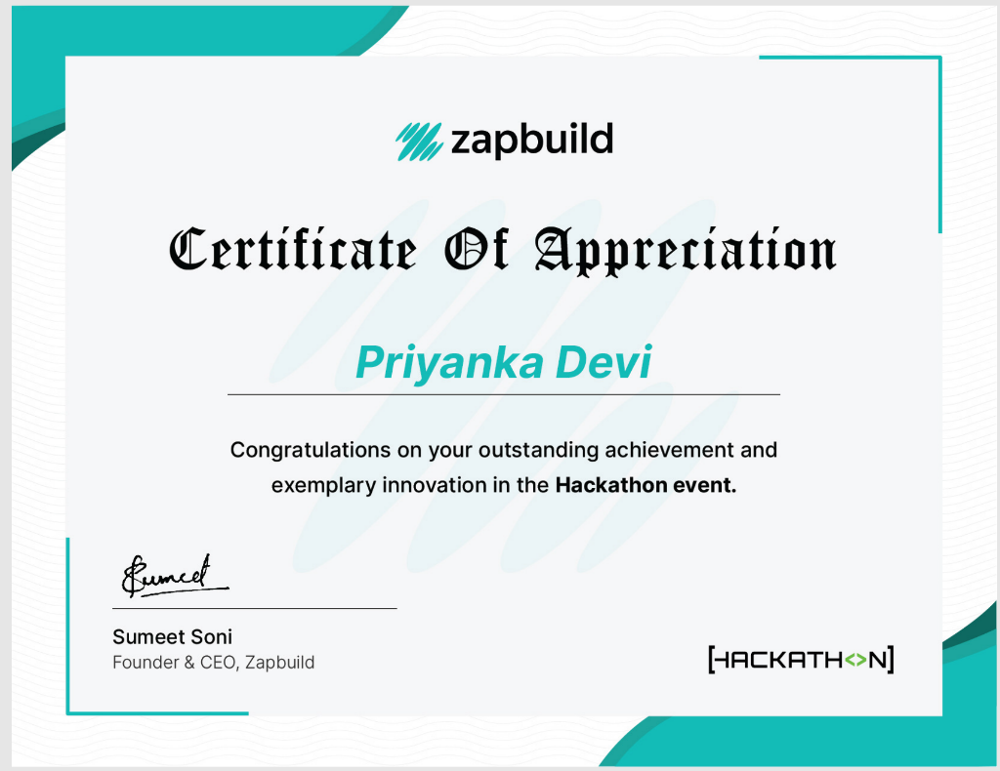

# Enterprise BugTracker & Engineering Management SaaS

[](https://vercel.com/new/clone?repository-url=https://github.com/Priyamittal-dev/bug-tracker)
[](https://render.com/deploy?repo=https://github.com/Priyamittal-dev/bug-tracker)


A production-grade, multi-tenant engineering management and defect-tracking SaaS built with Next.js 16 (Turbopack, App Router), React 19, Auth.js (NextAuth v5), Prisma ORM, Tailwind CSS 4, and Redis.

Inspired by Jira, Linear, and Zoho BugTracker.

---

## 🏆 Hackathon Innovation & Recognition

<div align="center">
  
  <p><em>Awarded to <strong>Priyanka Devi</strong> for outstanding achievement and exemplary innovation in the <strong>Zapbuild Hackathon</strong> event.</em></p>
</div>

---

## 🚀 1-Click Production Deployment

### Option 1: Deploy with Vercel (Fastest & Recommended)
Deploy instantly to Vercel's global edge network:
1. Click **[Deploy with Vercel](https://vercel.com/new/clone?repository-url=https://github.com/Priyamittal-dev/bug-tracker)**.
2. Connect your GitHub account and select repository `Priyamittal-dev/bug-tracker`.
3. Add your environment variables:
   - `DATABASE_URL`: Your PostgreSQL / SQLite connection string.
   - `AUTH_SECRET`: A 32-character random secret.
4. Click **Deploy** — your app is live with automated SSL and edge caching!

---

### Option 2: Deploy with Render (Full-Stack + Managed Database)
Click **[Deploy to Render](https://render.com/deploy?repo=https://github.com/Priyamittal-dev/bug-tracker)**:
- Automatically provisions a managed database and builds the Next.js service via `render.yaml`.

---

### Option 3: Deploy with Docker Compose (Self-Hosted on Any Cloud VM)
Run the entire production stack (Next.js app + PostgreSQL + Redis + MinIO) with one command:
```bash
docker compose up -d --build
```
The full application and database will be live at `http://localhost:3000`.

---

## 🌟 Core Architecture & Capabilities

### 1. 💳 PCI-Compliant Billing, Subscriptions & Payment Gateway
- **Multi-Tier Subscriptions:** Free, Team ($29/mo), Business ($79/mo), and Enterprise ($199/mo) with dynamic yearly discounts (-17%) and seat pricing calculator.
- **Secure Tokenized Payment Methods:** Card (Visa, Mastercard, Amex) and ACH bank transfers tokenized via sandbox gateway—raw PAN/CVC is never stored in the database.
- **Gateway Sandbox Mode:** Deterministic test card suite (`4242` approved, `0002` declined, `0069` insufficient funds, `0127` expired card, `0028` CVC mismatch, `3022` 3DS challenge, and ACH R03 rejection).
- **Printable Invoices:** Formal VAT/GST tax invoice modal with 1-click printable receipt rendering (`window.print()`).
- **Ledger Audit & Refund Processing:** Full transaction ledger tracking charges, voids, and refunds with payment gateway IDs.

### 2. 📖 Interactive API Documentation (Swagger UI & Stoplight Elements)
- **Stoplight Elements Explorer (`/docs`):** 3-column developer portal featuring real-time endpoint navigation, parameter schema tables, interactive sandbox with live request dispatch, and multi-language code generators (**cURL**, **JavaScript `fetch`**, **Python `requests`**).
- **Swagger UI (`/docs`):** Classic OpenAPI 3.0 view with colored HTTP badges (`GET`, `POST`, `PUT`, `PATCH`, `DELETE`) and tag grouping.
- **OpenAPI 3.0.3 Spec:** Machine-readable specification endpoint at `/api/v1/docs/openapi.json`.

### 3. 🔍 Global Spotlight Search (⌘K / Ctrl+K)
- **Raycast/macOS Command Palette:** Floating keyboard-driven search modal accessible globally across every screen.
- **Instant Search:** Real-time query matching across active defects (`CLOUD-101` through `CLOUD-105`), project workspaces, navigation destinations, and quick actions.
- **Keyboard Navigation:** Full arrow key navigation (`↑`, `↓`), Enter to trigger, and Escape to dismiss.

### 4. 🏢 Multi-Tenancy & Zero-Trust RBAC
- **Strict Tenant Boundaries:** Zero-leakage data isolation across organizations, workspaces, and squads.
- **Seamless OAuth Onboarding:** Auto-provisions personal workspaces for Google and GitHub users upon first login, ensuring zero-friction onboarding.
- **Role Hierarchy:** Granular roles (`OWNER`, `ADMIN`, `PROJECT_MANAGER`, `DEVELOPER`, `QA_ENGINEER`, `VIEWER`).

### 5. 🐞 Agile Sprints & Defect Intelligence
- **Kanban Board & Sprint Burndown:** Drag-and-drop state progression with real-time SSE updates.
- **Reproducible Defect Schemas:** Structured reproduction steps, stack traces, severity badges, and automated SLA compliance timers.
- **Time Tracking:** Integrated worklog tracking with billable hours calculation.

---

## 🧪 Comprehensive Test Suite

Run unit and integration tests locally:
```bash
# Run lightning-fast unit tests
npm run test:unit

# Run full Vitest suite (all 209 tests)
npm test
```

---

## 🛠 Tech Stack

| Layer | Technologies |
|---|---|
| **Framework** | Next.js 16.3.6 (Turbopack, App Router, React 19) |
| **Authentication** | Auth.js (NextAuth v5 beta), Google OAuth, GitHub OAuth, bcryptjs |
| **Database & ORM** | Prisma ORM 5.22, SQLite / PostgreSQL |
| **Styling** | Tailwind CSS 4, Lucide Icons, Glassmorphic UI Tokens |
| **API Docs** | OpenAPI 3.0.3, Stoplight Elements, Swagger UI |
| **Testing** | Vitest 5.0.2, Testing Library |

---

## 👤 Author & Maintainer

**Priyanka Devi**
- **GitHub:** [@Priyamittal-dev](https://github.com/Priyamittal-dev)
- **Repository:** [Priyamittal-dev/bug-tracker](https://github.com/Priyamittal-dev/bug-tracker)
